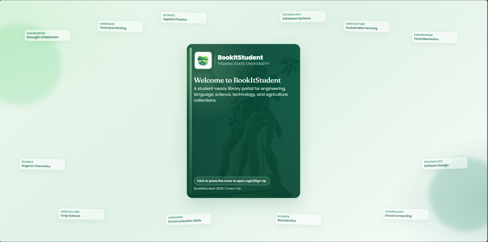
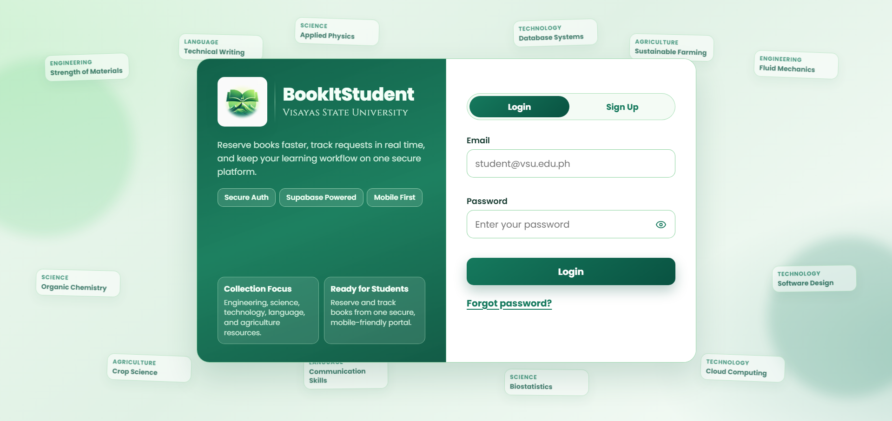

    <table width="100%" cellpadding="10" cellspacing="0" style="font-family: Arial, sans-serif; border-collapse: collapse;">
        <tr>
            <td colspan="2" style="padding-bottom: 20px;">
                <h1 style="margin: 0;">DigitalWare Library System</h1>
                
Target: DW010.001

            </td>
        </tr>
        <tr>
            <td width="25%" valign="top" style="border: 1px solid #e0e0e0; border-right: none;">
                <h2 style="margin-top: 0;">Site Map</h2>
                <a href="../../README.md">Homepage</a>                   
                
<strong>1. Authentication & Identity</strong>

                <ul style="list-style-type: none; padding-left: 0; font-size: 0.9em;">
                    <li style="padding-left: 15px"> <a href="authentication-sign-up.md"> Login with Google (FR 1.0) </a></li>
                </ul>
                
<strong>2. Student Viewer Hub</strong>

                <ul style="list-style-type: none; padding-left: 0; font-size: 0.9em;">
                    <li style="padding-left: 15px"><a href="../student/dashboard.md">Dashboard (FR 1.0)</a></li>
                    <li style="padding-left: 15px"><a href="../student/reserve-book.md">Reserve Book (FR 2.0)</a></li>
                    <li style="padding-left: 15px"><a href="../student/reservation-notifier.md">Reservation Notifier (FR 2.1)</a></li>
                    <li style="padding-left: 15px"><a href="../student/book-search.md">Book Search (FR 3.0)</a></li>
                    <li style="padding-left: 15px"><a href="../student/availability.md">Real-Time Availability (FR 4.0)</a></li>
                    <li style="padding-left: 15px"><a href="../student/borrowing-history.md">Borrowing History (FR 5.0)</a></li>
                    <li style="padding-left: 15px"><a href="../student/book-categories.md">Book Categories (FR 6.0)</a></li>
                </ul>
                
<strong>3. Librarian Management Portal</strong>

                <ul style="list-style-type: none; padding-left: 0; font-size: 0.9em;">
                    <li style="padding-left: 15px"><a href="../librarian/dashboard.md">Librarian Dashboard (FR 7.0)</a></li>
                    <li style="padding-left: 15px"><a href="../librarian/approve-checkout.md">Approve Checkout (FR 7.0)</a></li>
                    <li style="padding-left: 15px"><a href="../librarian/process-return.md">Process Return (FR 7.0)</a></li>
                    <li style="padding-left: 15px"><a href="../librarian/book-record-manager.md">Book Record Manager (FR 7.0)</a></li>
                    <li style="padding-left: 15px"><a href="../librarian/overdue-notifier.md">Overdue Notifier (FR 8.0)</a></li>
                </ul>
                
<strong>4. Shared</strong>

                <ul style="list-style-type: none; padding-left: 0; font-size: 0.9em;">
                    <li style="padding-left: 15px"><a href="../shared/account-settings.md">Account Settings (FR 1.0)</a></li>
                    <li style="padding-left: 15px"><a href="../shared/book-detail.md">Book Detail (FR 3.0 / 4.0)</a></li>
                    <li style="padding-left: 15px"><a href="../shared/notification-center.md">Notification Center (FR 2.1 / 8.0)</a></li>
                </ul>
            </td>
            <td valign="top" style="border: 1px solid #e0e0e0; padding: 20px;">
                

                    <a href="." style="text-decoration: none;">Authentication</a> &gt; 
                    <a href="authentication-sign-up.md" style="color: #ac9e9e; font-weight: bold; text-decoration: none;">Log in</a>
                
           
                

                    
                

                

                    
                

                <h2 style="margin-top: 0;">Account Creation (FR 1.0)</h2>
                
The Login with Google feature enables students and librarians to securely access BookItStudent using their VSU institutional Google account (@vsu.edu.ph). It eliminates the need for manual registration and password management by leveraging Google OAuth. Upon first login, the system automatically creates a linked account and assigns the appropriate role.

                
This feature improves accessibility and security by providing a fast, reliable, and institution-controlled sign-in process. It automatically retrieves basic user information such as name and email and creates or links a user account within the system for seamless access to library services.

                <h3>Use Case Scenario</h3>
                <table border="1" width="100%" cellpadding="8" cellspacing="0" style="border-collapse: collapse; font-size: 0.9em; border: 1px solid #ddd;">
                    <tr>
                        <th width="20%" align="left">Actor(s)</th>
                        <td>Student, Librarian, Google Authentication Service</d>
                    </tr>
                    <tr>
                        <th align="left">Goal</th>
                        <td>To securely authenticate and access the BookItStudent system using a VSU Google account without manual registration.</d>
                    </tr>
                    <tr>
                        <th align="left">Preconditions</th>
                        <td>1. User has a valid VSU Google account (@vsu.edu.ph). 2. User has internet connectivity. 3. Google OAuth service is available.</d>
                    </tr>
                    <tr>
                        <th align="left">Main Scenario</th>
                        <td>1. User clicks the "Login" button on the homepage. 2. System redirects the user to the login page. 3. User clicks "Continue with Google" and enters their VSU Google account credentials. 4. Google verifies the account and sends authentication data to the system. 5. System validates that the email domain is @vsu.edu.ph. 6. System creates or links a user account and assigns a role. 7. System grants access and redirects the user to the dashboard.</d>
                    </tr>
                    <tr>
                        <th align="left">Outcome</th>
                        <td>User is authenticated and redirected to their role-appropriate dashboard. A user account is created in the system if it did not previously exist.</d>
                    </tr>
                </table>
            </d>
        </tr>
        <tr>
            <td colspan="2" align="center" style="padding-top: 30px; font-size: 0.8em; color: #999;">
                

                © 2026 DigitalWare | OnTrack VSU SSC
            </d>
        </tr>
    </table>

