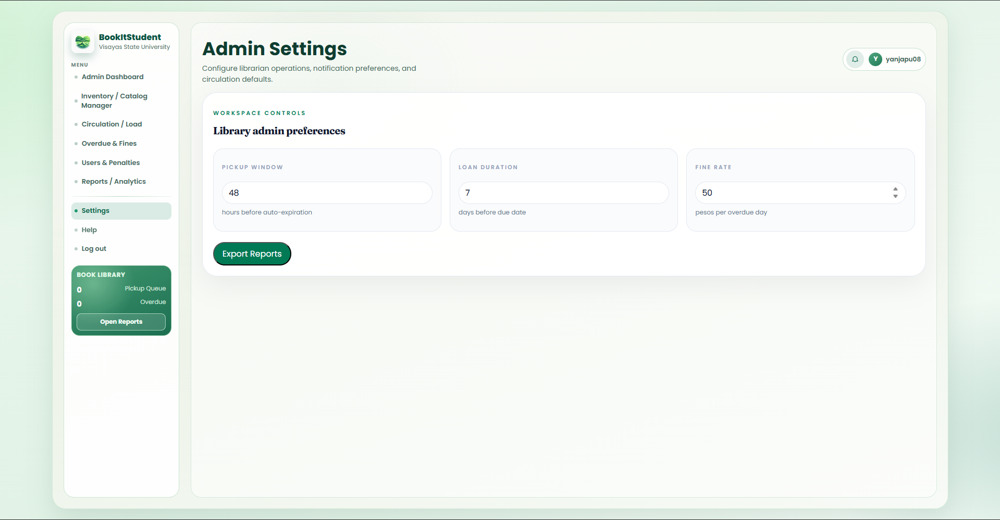

    <table width="100%" cellpadding="10" cellspacing="0" style="font-family: Arial, sans-serif; border-collapse: collapse;">
        <tr>
            <td colspan="2" style="padding-bottom: 20px;">
                <h1 style="margin: 0;">DIWATA</h1>
                
Target: `DW010.001`

            </td>
        </tr>
        <tr>
            <td width="25%" valign="top" style="border: 1px solid #e0e0e0; border-right: none;">
                <h2 style="margin-top: 0;">Site Map</h2>
                <a href="../../README.md">Homepage</a>                   
                
<strong>1. Authentication & Identity</strong>

                <ul style="list-style-type: none; padding-left: 0; font-size: 0.9em;">
                    <li style="padding-left: 15px"> <a href="../auth/authentication-sign-up.md"> Login with Google (FR 1.0) </a></li>
                </ul>
                
<strong>2. Student Viewer Hub</strong>

                <ul style="list-style-type: none; padding-left: 0; font-size: 0.9em;">
                    <li style="padding-left: 15px"><a href="../student/dashboard.md">Dashboard (FR 1.0)</a></li>
                    <li style="padding-left: 15px"><a href="../student/reserve-book.md">Reserve Book (FR 2.0)</a></li>
                    <li style="padding-left: 15px"><a href="../student/reservation-notifier.md">Reservation Notifier (FR 2.1)</a></li>
                    <li style="padding-left: 15px"><a href="../student/book-search.md">Book Search (FR 3.0)</a></li>
                    <li style="padding-left: 15px"><a href="../student/availability.md">Real-Time Availability (FR 4.0)</a></li>
                    <li style="padding-left: 15px"><a href="../student/borrowing-history.md">Borrowing History (FR 5.0)</a></li>
                    <li style="padding-left: 15px"><a href="../student/book-categories.md">Book Categories (FR 6.0)</a></li>
                    <li style="padding-left: 15px"><a href="../student/account-settings.md">Account Settings (FR 1.0)</a></li>
                </ul>
                
<strong>3. Librarian Management Portal</strong>

                <ul style="list-style-type: none; padding-left: 0; font-size: 0.9em;">
                    <li style="padding-left: 15px"><a href="dashboard.md">Librarian Dashboard (FR 7.0)</a></li>
                    <li style="padding-left: 15px"><a href="approve-checkout.md">Approve Checkout (FR 7.0)</a></li>
                    <li style="padding-left: 15px"><a href="process-return.md">Process Return (FR 7.0)</a></li>
                    <li style="padding-left: 15px"><a href="book-record-manager.md">Book Record Manager (FR 7.0)</a></li>
                    <li style="padding-left: 15px"><a href="overdue-notifier.md">Overdue Notifier (FR 8.0)</a></li>
                    <li style="padding-left: 15px"><a href="admin-settings.md">Admin Settings</a></li>
                </ul>
                
<strong>4. Shared</strong>

                <ul style="list-style-type: none; padding-left: 0; font-size: 0.9em;">
                    <li style="padding-left: 15px"><a href="../shared/book-detail.md">Book Detail (FR 3.0 / 4.0)</a></li>
                    <li style="padding-left: 15px"><a href="../shared/notification-center.md">Notification Center (FR 2.1 / 8.0)</a></li>
                </ul>
            </d>
            <td valign="top" style="border: 1px solid #e0e0e0; padding: 20px;">
                

                    <a href="." style="text-decoration: none;">Librarian Management Portal</a> &gt; 
                    <a href="admin-settings.md" style="color: #ac9e9e; font-weight: bold; text-decoration: none;">Admin Settings</a>
                
           
                

                    
                

                <h2 style="margin-top: 0;">Admin Settings</h2>
                
The Admin Settings feature allows librarians and administrators to configure global system preferences, library operation rules, and circulation defaults. This includes setting pickup windows, loan durations, fine rates, and notification preferences for the entire library system.

                
These settings apply to all users and library operations, ensuring consistent policies across the institution.

                <h3>Workspace Controls - Library Admin Preferences</h3>
                <h4>📦 Pickup Window</h4>
                
Sets the time limit for students to pick up their reserved books before the reservation automatically expires. If a student does not claim the book within this window, the reservation is cancelled and the book becomes available for other students.

                
<strong>Default setting:</strong> 48 hours before auto-expiration

                <h4>⏱️ Loan Duration</h4>
                
Defines the standard borrowing period for books checked out by students. The system automatically calculates the due date based on this setting and sends reminders as the due date approaches.

                
<strong>Default setting:</strong> 7 days before due date

                <h4>💰 Fine Rate</h4>
                
Sets the penalty amount charged per day when a student returns a book after the due date. The system automatically calculates fines based on this rate and the number of overdue days.

                
<strong>Default setting:</strong> 50 pesos per overdue day

                <h3>Use Case Scenario</h3>
                <table border="1" width="100%" cellpadding="8" cellspacing="0" style="border-collapse: collapse; font-size: 0.9em; border: 1px solid #ddd;">
                    <tr>
                        <th width="20%" align="left">Actor(s)</th>
                        <td>Librarian / Administrator</d>
                    </tr>
                    <tr>
                        <th align="left">Goal</th>
                        <td>To configure global library policies including pickup window, loan duration, and fine rates.</d>
                    </tr>
                    <tr>
                        <th align="left">Preconditions</th>
                        <td>1. User is logged in with Administrator privileges. 2. User has permission to modify system settings.</d>
                    </tr>
                    <tr>
                        <th align="left">Main Scenario</th>
                        <td>1. Administrator navigates to Admin Settings page. 2. System displays current configuration values. 3. Administrator modifies Pickup Window, Loan Duration, or Fine Rate. 4. System validates the input values. 5. Administrator saves the changes. 6. System applies new settings to all future library transactions. 7. System confirms the settings have been updated.</d>
                    </tr>
                    <tr>
                        <th align="left">Alternative Flow</th>
                        <td>If invalid values are entered (e.g., negative numbers), the system displays an error message and reverts to previous valid settings.</d>
                    </tr>
                    <tr>
                        <th align="left">Outcome</th>
                        <td>Global library policies are updated. All future reservations, checkouts, and fine calculations use the new settings.</d>
                    </tr>
                </table>
                <h3>Quick Actions</h3>
                <ul>
                    <li>📋 Export Reports - Generate system configuration reports</li>
                </ul>
            </d>
        </tr>
        <tr>
            <td colspan="2" align="center" style="padding-top: 30px; font-size: 0.8em; color: #999;">
                

                   © 2026 Enera  | BookItStudent
            </d>
        </tr>
    </table>

