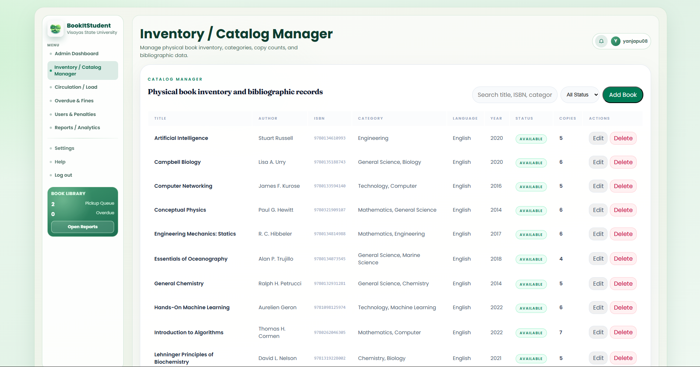

    <table width="100%" cellpadding="10" cellspacing="0" style="font-family: Arial, sans-serif; border-collapse: collapse;">
        <tr>
            <td colspan="2" style="padding-bottom: 20px;">
                <h1 style="margin: 0;">DIWATA</h1>
                
Target: `DW010.001`

            </td>
        </tr>
        <tr>
            <td width="25%" valign="top" style="border: 1px solid #e0e0e0; border-right: none;">
                <h2 style="margin-top: 0;">Site Map</h2>
                <a href="../../README.md">Homepage</a>                   
                
<strong>1. Authentication & Identity</strong>

                <ul style="list-style-type: none; padding-left: 0; font-size: 0.9em;">
                    <li style="padding-left: 15px"> <a href="../auth/authentication-sign-up.md"> Login with Google (FR 1.0) </a></li>
                </ul>
                
<strong>2. Student Viewer Hub</strong>

                <ul style="list-style-type: none; padding-left: 0; font-size: 0.9em;">
                    <li style="padding-left: 15px"><a href="../student/dashboard.md">Dashboard (FR 1.0)</a></li>
                    <li style="padding-left: 15px"><a href="../student/reserve-book.md">Reserve Book (FR 2.0)</a></li>
                    <li style="padding-left: 15px"><a href="../student/reservation-notifier.md">Reservation Notifier (FR 2.1)</a></li>
                    <li style="padding-left: 15px"><a href="../student/book-search.md">Book Search (FR 3.0)</a></li>
                    <li style="padding-left: 15px"><a href="../student/availability.md">Real-Time Availability (FR 4.0)</a></li>
                    <li style="padding-left: 15px"><a href="../student/borrowing-history.md">Borrowing History (FR 5.0)</a></li>
                    <li style="padding-left: 15px"><a href="../student/book-categories.md">Book Categories (FR 6.0)</a></li>
                    <li style="padding-left: 15px"><a href="../student/account-settings.md">Account Settings (FR 1.0)</a></li>
                </ul>
                
<strong>3. Librarian Management Portal</strong>

                <ul style="list-style-type: none; padding-left: 0; font-size: 0.9em;">
                    <li style="padding-left: 15px"><a href="dashboard.md">Librarian Dashboard (FR 7.0)</a></li>
                    <li style="padding-left: 15px"><a href="approve-checkout.md">Approve Checkout (FR 7.0)</a></li>
                    <li style="padding-left: 15px"><a href="process-return.md">Process Return (FR 7.0)</a></li>
                    <li style="padding-left: 15px"><a href="book-record-manager.md">Book Record Manager (FR 7.0)</a></li>
                    <li style="padding-left: 15px"><a href="overdue-notifier.md">Overdue Notifier (FR 8.0)</a></li>
                </ul>
                
<strong>4. Shared</strong>

                <ul style="list-style-type: none; padding-left: 0; font-size: 0.9em;">
                    <li style="padding-left: 15px"><a href="../shared/book-detail.md">Book Detail (FR 3.0 / 4.0)</a></li>
                    <li style="padding-left: 15px"><a href="../shared/notification-center.md">Notification Center (FR 2.1 / 8.0)</a></li>
                </ul>
            </td>
            <td valign="top" style="border: 1px solid #e0e0e0; padding: 20px;">
                

                    <a href="." style="text-decoration: none;">Librarian Management Portal</a> &gt; 
                    <a href="book-record-manager.md" style="color: #ac9e9e; font-weight: bold; text-decoration: none;">Book Record Manager</a>
                
           
                

                    
                

                <h2 style="margin-top: 0;">Book Record Manager (FR 7.0)</h2>
                
The Book Record Manager feature allows librarians to create, update, and delete book records in the library catalog. Librarians can add new books to the system, edit existing book information (title, author, ISBN, publication date, category), and remove outdated records.

                
This feature ensures that the library catalog remains accurate and up-to-date. Librarians can also manage book copies, track inventory, and update availability status directly from the Book Record Manager interface.

                <h3>Use Case Scenario</h3>
                <table border="1" width="100%" cellpadding="8" cellspacing="0" style="border-collapse: collapse; font-size: 0.9em; border: 1px solid #ddd;">
                    <tr>
                        <th width="20%" align="left">Actor(s)</th>
                        <td>Librarian</d>
                    </tr>
                    <tr>
                        <th align="left">Goal</th>
                        <td>To add, edit, or remove book records in the library catalog.</d>
                    </tr>
                    <tr>
                        <th align="left">Preconditions</th>
                        <td>1. Librarian is logged into the system. 2. Librarian has catalog management permissions.</d>
                    </tr>
                    <tr>
                        <th align="left">Main Scenario</th>
                        <td>1. Librarian navigates to Book Record Manager. 2. System displays the current book catalog. 3. Librarian selects to add a new book, edit existing, or delete a record. 4. If adding/editing, Librarian fills in book details (title, author, ISBN, etc.). 5. System validates the information and saves changes. 6. System updates the catalog and confirms the action.</d>
                    </tr>
                    <tr>
                        <th align="left">Outcome</th>
                        <td>Book catalog is updated. New books are available for student search and reservation. Removed books are no longer visible.</d>
                    </tr>
                </table>
            </d>
        </tr>
        <tr>
            <td colspan="2" align="center" style="padding-top: 30px; font-size: 0.8em; color: #999;">
                

                 © 2026 Enera  | BookItStudent
            </d>
        </tr>
    </table>

