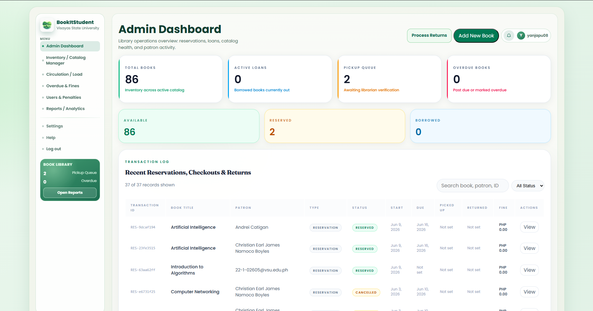

    <table width="100%" cellpadding="10" cellspacing="0" style="font-family: Arial, sans-serif; border-collapse: collapse;">
        <tr>
            <td colspan="2" style="padding-bottom: 20px;">
                <h1 style="margin: 0;">DIWATA</h1>
                
Target: `DW010.001`

            </td>
        </tr>
        <tr>
            <td width="25%" valign="top" style="border: 1px solid #e0e0e0; border-right: none;">
                <h2 style="margin-top: 0;">Site Map</h2>
                <a href="../../README.md">Homepage</a>                   
                
<strong>1. Authentication & Identity</strong>

                <ul style="list-style-type: none; padding-left: 0; font-size: 0.9em;">
                    <li style="padding-left: 15px"> <a href="../auth/authentication-sign-up.md"> Login with Google (FR 1.0) </a></li>
                </ul>
                
<strong>2. Student Viewer Hub</strong>

                <ul style="list-style-type: none; padding-left: 0; font-size: 0.9em;">
                    <li style="padding-left: 15px"><a href="../student/dashboard.md">Dashboard (FR 1.0)</a></li>
                    <li style="padding-left: 15px"><a href="../student/reserve-book.md">Reserve Book (FR 2.0)</a></li>
                    <li style="padding-left: 15px"><a href="../student/reservation-notifier.md">Reservation Notifier (FR 2.1)</a></li>
                    <li style="padding-left: 15px"><a href="../student/book-search.md">Book Search (FR 3.0)</a></li>
                    <li style="padding-left: 15px"><a href="../student/availability.md">Real-Time Availability (FR 4.0)</a></li>
                    <li style="padding-left: 15px"><a href="../student/borrowing-history.md">Borrowing History (FR 5.0)</a></li>
                    <li style="padding-left: 15px"><a href="../student/book-categories.md">Book Categories (FR 6.0)</a></li>
                    <li style="padding-left: 15px"><a href="../student/account-settings.md">Account Settings (FR 1.0)</a></li>
                </ul>
                
<strong>3. Librarian Management Portal</strong>

                <ul style="list-style-type: none; padding-left: 0; font-size: 0.9em;">
                    <li style="padding-left: 15px"><a href="dashboard.md">Librarian Dashboard (FR 7.0)</a></li>
                    <li style="padding-left: 15px"><a href="approve-checkout.md">Approve Checkout (FR 7.0)</a></li>
                    <li style="padding-left: 15px"><a href="process-return.md">Process Return (FR 7.0)</a></li>
                    <li style="padding-left: 15px"><a href="book-record-manager.md">Book Record Manager (FR 7.0)</a></li>
                    <li style="padding-left: 15px"><a href="overdue-notifier.md">Overdue Notifier (FR 8.0)</a></li>
                </ul>
                
<strong>4. Shared</strong>

                <ul style="list-style-type: none; padding-left: 0; font-size: 0.9em;">
                    <li style="padding-left: 15px"><a href="../shared/book-detail.md">Book Detail (FR 3.0 / 4.0)</a></li>
                    <li style="padding-left: 15px"><a href="../shared/notification-center.md">Notification Center (FR 2.1 / 8.0)</a></li>
                </ul>
            </td>
            <td valign="top" style="border: 1px solid #e0e0e0; padding: 20px;">
                

                    <a href="." style="text-decoration: none;">Librarian Management Portal</a> &gt; 
                    <a href="dashboard.md" style="color: #ac9e9e; font-weight: bold; text-decoration: none;">Dashboard</a>
                
           
                

                    
                

                <h2 style="margin-top: 0;">Librarian Dashboard (FR 7.0)</h2>
                
The Librarian Dashboard is the main landing page for authenticated librarians. It provides an overview of library operations including active checkouts, pending approvals, overdue books, and reservation requests. The dashboard serves as the central hub for managing all library activities.

                
Librarians can quickly access key management features such as approving checkouts, processing returns, managing book records, and sending overdue notifications directly from the dashboard interface.

                <h3>Use Case Scenario</h3>
                <table border="1" width="100%" cellpadding="8" cellspacing="0" style="border-collapse: collapse; font-size: 0.9em; border: 1px solid #ddd;">
                    <tr>
                        <th width="20%" align="left">Actor(s)</th>
                        <td>Librarian</d>
                    </tr>
                    <tr>
                        <th align="left">Goal</th>
                        <td>To view library operations summary and access management features.</d>
                    </tr>
                    <tr>
                        <th align="left">Preconditions</th>
                        <td>1. Librarian is authenticated via Google OAuth. 2. Librarian has admin privileges.</d>
                    </tr>
                    <tr>
                        <th align="left">Main Scenario</th>
                        <td>1. Librarian successfully logs in. 2. System redirects to the Librarian Dashboard. 3. Dashboard displays active checkouts, pending approvals, and overdue books. 4. Librarian selects a management feature to perform tasks.</d>
                    </tr>
                    <tr>
                        <th align="left">Outcome</th>
                        <td>Librarian can access and manage all library operations from the dashboard.</d>
                    </tr>
                </table>
            </d>
        </tr>
        <tr>
            <td colspan="2" align="center" style="padding-top: 30px; font-size: 0.8em; color: #999;">
                

                 © 2026 Enera  | BookItStudent
            </d>
        </tr>
    </table>

