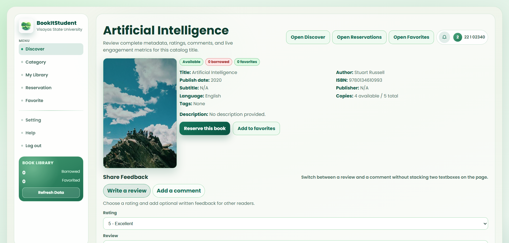

    <table width="100%" cellpadding="10" cellspacing="0" style="font-family: Arial, sans-serif; border-collapse: collapse;">
        <tr>
            <td colspan="2" style="padding-bottom: 20px;">
                <h1 style="margin: 0;">DIWATA</h1>
                
Target: DW010.001

            </td>
        </tr>
        <tr>
            <td width="25%" valign="top" style="border: 1px solid #e0e0e0; border-right: none;">
                <h2 style="margin-top: 0;">Site Map</h2>
                <a href="../README.md">Homepage</a>                   
                
<strong>1. Authentication & Identity</strong>

                <ul style="list-style-type: none; padding-left: 0; font-size: 0.9em;">
                    <li style="padding-left: 15px"> <a href="../auth/authentication-sign-up.md"> Login with Google (FR 1.0) </a></li>
                </ul>
                
<strong>2. Student Viewer Hub</strong>

                <ul style="list-style-type: none; padding-left: 0; font-size: 0.9em;">
                    <li style="padding-left: 15px"><a href="../student/dashboard.md">Dashboard (FR 1.0)</a></li>
                    <li style="padding-left: 15px"><a href="../student/reserve-book.md">Reserve Book (FR 2.0)</a></li>
                    <li style="padding-left: 15px"><a href="../student/reservation-notifier.md">Reservation Notifier (FR 2.1)</a></li>
                    <li style="padding-left: 15px"><a href="../student/book-search.md">Book Search (FR 3.0)</a></li>
                    <li style="padding-left: 15px"><a href="../student/availability.md">Real-Time Availability (FR 4.0)</a></li>
                    <li style="padding-left: 15px"><a href="../student/borrowing-history.md">Borrowing History (FR 5.0)</a></li>
                    <li style="padding-left: 15px"><a href="../student/book-categories.md">Book Categories (FR 6.0)</a></li>
                </ul>
                
<strong>3. Librarian Management Portal</strong>

                <ul style="list-style-type: none; padding-left: 0; font-size: 0.9em;">
                    <li style="padding-left: 15px"><a href="../librarian/dashboard.md">Librarian Dashboard (FR 7.0)</a></li>
                    <li style="padding-left: 15px"><a href="../librarian/approve-checkout.md">Approve Checkout (FR 7.0)</a></li>
                    <li style="padding-left: 15px"><a href="../librarian/process-return.md">Process Return (FR 7.0)</a></li>
                    <li style="padding-left: 15px"><a href="../librarian/book-record-manager.md">Book Record Manager (FR 7.0)</a></li>
                    <li style="padding-left: 15px"><a href="../librarian/overdue-notifier.md">Overdue Notifier (FR 8.0)</a></li>
                </ul>
                
<strong>4. Shared</strong>

                <ul style="list-style-type: none; padding-left: 0; font-size: 0.9em;">
                    <li style="padding-left: 15px"><a href="../shared/account-settings.md">Account Settings (FR 1.0)</a></li>
                    <li style="padding-left: 15px"><a href="../shared/book-detail.md">Book Detail (FR 3.0 / 4.0)</a></li>
                    <li style="padding-left: 15px"><a href="../shared/notification-center.md">Notification Center (FR 2.1 / 8.0)</a></li>
                </ul>
            </td>
            <td valign="top" style="border: 1px solid #e0e0e0; padding: 20px;">
                

                    <a href="docs/shared/" style="text-decoration: none;">Shared</a> &gt; 
                    <a href="docs/shared/book-detail.md" style="color: #ac9e9e; font-weight: bold; text-decoration: none;">Book Detail</a>
                
           
                

                    
                

                <h2 style="margin-top: 0;">Book Detail (FR 3.0 / 4.0)</h2>
                
The Book Detail page provides comprehensive information about a specific book in the library catalog. This shared component is accessible from search results, book categories, and borrowing history. It displays essential details including title, author, ISBN, publication date, publisher, description, and availability status.

                
Students can reserve a book directly from this page if it is available. The page also shows real-time availability, expected return dates for checked-out books, and a calendar view of reserved time slots. Librarians can access additional management options from this view.

                <h3>Use Case Scenario</h3>
                <table border="1" width="100%" cellpadding="8" cellspacing="0" style="border-collapse: collapse; font-size: 0.9em; border: 1px solid #ddd;">
                    <tr>
                        <th width="20%" align="left">Actor(s)</th>
                        <td>Student, Librarian</d>
                    </tr>
                    <tr>
                        <th align="left">Goal</th>
                        <td>To view complete book information and perform actions like reservation or management.</d>
                    </tr>
                    <tr>
                        <th align="left">Preconditions</th>
                        <td>1. User is logged into the system. 2. The book record exists in the library catalog.</d>
                    </tr>
                    <tr>
                        <th align="left">Main Scenario</th>
                        <td>1. User clicks on a book from search results, categories, or history. 2. System displays the Book Detail page with full book information. 3. User views availability status and book description. 4. Student clicks "Reserve" if the book is available. 5. Librarian clicks "Edit" to modify book records.</d>
                    </tr>
                    <tr>
                        <th align="left">Outcome</th>
                        <td>User obtains complete book information and can take appropriate action based on role (student reserves, librarian manages).</d>
                    </tr>
                </table>
            </d>
        </tr>
        <tr>
            <td colspan="2" align="center" style="padding-top: 30px; font-size: 0.8em; color: #999;">
                

                © 2026 BookItStudent | VSU Library System
            </d>
        </tr>
    </table>

