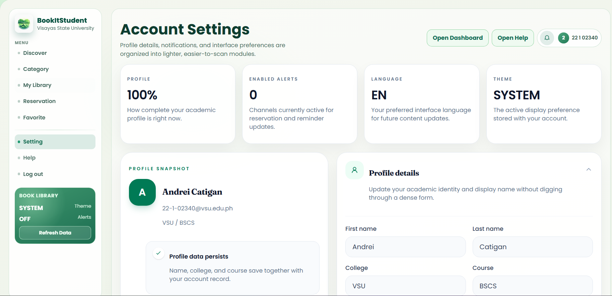

    <table width="100%" cellpadding="10" cellspacing="0" style="font-family: Arial, sans-serif; border-collapse: collapse;">
        <tr>
            <td colspan="2" style="padding-bottom: 20px;">
                <h1 style="margin: 0;">DIWATA</h1>
                
Target: DW010.001

            </td>
        </tr>
        <tr>
            <td width="25%" valign="top" style="border: 1px solid #e0e0e0; border-right: none;">
                <h2 style="margin-top: 0;">Site Map</h2>
                <a href="../../README.md">Homepage</a>                   
                
<strong>1. Authentication & Identity</strong>

                <ul style="list-style-type: none; padding-left: 0; font-size: 0.9em;">
                    <li style="padding-left: 15px"> <a href="../auth/authentication-sign-up.md"> Login with Google (FR 1.0) </a></li>
                </ul>
                
<strong>2. Student Viewer Hub</strong>

                <ul style="list-style-type: none; padding-left: 0; font-size: 0.9em;">
                    <li style="padding-left: 15px"><a href="dashboard.md">Dashboard (FR 1.0)</a></li>
                    <li style="padding-left: 15px"><a href="reserve-book.md">Reserve Book (FR 2.0)</a></li>
                    <li style="padding-left: 15px"><a href="reservation-notifier.md">Reservation Notifier (FR 2.1)</a></li>
                    <li style="padding-left: 15px"><a href="book-search.md">Book Search (FR 3.0)</a></li>
                    <li style="padding-left: 15px"><a href="availability.md">Real-Time Availability (FR 4.0)</a></li>
                    <li style="padding-left: 15px"><a href="borrowing-history.md">Borrowing History (FR 5.0)</a></li>
                    <li style="padding-left: 15px"><a href="book-categories.md">Book Categories (FR 6.0)</a></li>
                    <li style="padding-left: 15px"><a href="account-settings.md">Account Settings (FR 1.0)</a></li>
                </ul>
                
<strong>3. Librarian Management Portal</strong>

                <ul style="list-style-type: none; padding-left: 0; font-size: 0.9em;">
                    <li style="padding-left: 15px"><a href="../librarian/dashboard.md">Librarian Dashboard (FR 7.0)</a></li>
                    <li style="padding-left: 15px"><a href="../librarian/approve-checkout.md">Approve Checkout (FR 7.0)</a></li>
                    <li style="padding-left: 15px"><a href="../librarian/process-return.md">Process Return (FR 7.0)</a></li>
                    <li style="padding-left: 15px"><a href="../librarian/book-record-manager.md">Book Record Manager (FR 7.0)</a></li>
                    <li style="padding-left: 15px"><a href="../librarian/overdue-notifier.md">Overdue Notifier (FR 8.0)</a></li>
                    <li style="padding-left: 15px"><a href="../librarian/admin-settings.md">Admin Settings</a></li>
                </ul>
                
<strong>4. Shared</strong>

                <ul style="list-style-type: none; padding-left: 0; font-size: 0.9em;">
                    <li style="padding-left: 15px"><a href="../shared/book-detail.md">Book Detail (FR 3.0 / 4.0)</a></li>
                    <li style="padding-left: 15px"><a href="../shared/notification-center.md">Notification Center (FR 2.1 / 8.0)</a></li>
                </ul>
            </td>
            <td valign="top" style="border: 1px solid #e0e0e0; padding: 20px;">
                

                    <a href="." style="text-decoration: none;">Student Viewer Hub</a> &gt; 
                    <a href="account-settings.md" style="color: #ac9e9e; font-weight: bold; text-decoration: none;">Account Settings</a>
                
           
                

                    
                

                <h2 style="margin-top: 0;">Account Settings (FR 1.0)</h2>
                
The Account Settings feature allows students to manage their personal profile information and preferences. Students can update their name, contact information, notification preferences, and password settings from a single, centralized interface.

                
<strong>Note:</strong> This feature is only available for students. Librarians and Administrators do not have personal profile settings as their accounts are managed by the system administrator.

                
Changes made in Account Settings are immediately reflected throughout the system, including the dashboard, borrowing history, and notification center.

                <h3>Use Case Scenario</h3>
                <table border="1" width="100%" cellpadding="8" cellspacing="0" style="border-collapse: collapse; font-size: 0.9em; border: 1px solid #ddd;">
                    <tr>
                        <th width="20%" align="left">Actor(s)</th>
                        <td>Student</d>
                    </tr>
                    <tr>
                        <th align="left">Goal</th>
                        <td>To update personal profile information and configure notification preferences.</d>
                    </tr>
                    <tr>
                        <th align="left">Preconditions</th>
                        <td>1. Student is logged into the system. 2. Student has a valid account.</d>
                    </tr>
                    <tr>
                        <th align="left">Main Scenario</th>
                        <td>1. Student navigates to Account Settings from the dashboard or user menu. 2. System displays current profile information and settings options. 3. Student updates desired fields (name, email, notification preferences). 4. Student clicks "Save Changes." 5. System validates the changes and updates the database. 6. System displays a confirmation message.</d>
                    </tr>
                    <tr>
                        <th align="left">Outcome</th>
                        <td>Student profile is updated successfully. Changes are reflected across the system.</d>
                    </tr>
                </table>
            </d>
        </tr>
        <tr>
            <td colspan="2" align="center" style="padding-top: 30px; font-size: 0.8em; color: #999;">
                

                 © 2026 Enera  | BookItStudent
            </d>
        </tr>
    </table>

