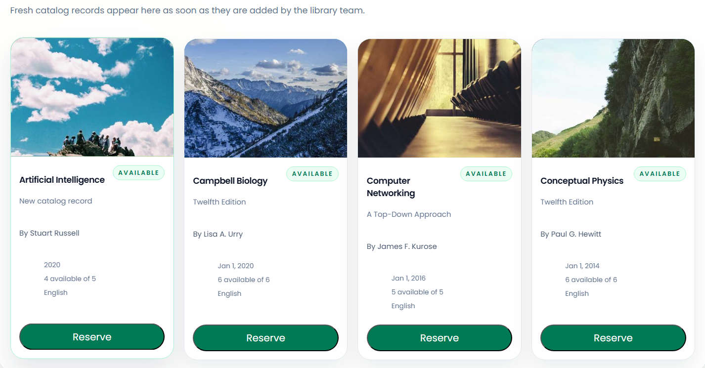

    <table width="100%" cellpadding="10" cellspacing="0" style="font-family: Arial, sans-serif; border-collapse: collapse;">
        <tr>
            <td colspan="2" style="padding-bottom: 20px;">
                <h1 style="margin: 0;">DIWATA</h1>
                
Target: DW010.001

            </td>
        </tr>
        <tr>
            <td width="25%" valign="top" style="border: 1px solid #e0e0e0; border-right: none;">
                <h2 style="margin-top: 0;">Site Map</h2>
                <a href="../../README.md">Homepage</a>                   
                
<strong>1. Authentication & Identity</strong>

                <ul style="list-style-type: none; padding-left: 0; font-size: 0.9em;">
                    <li style="padding-left: 15px"> <a href="../auth/authentication-sign-up.md"> Login with Google (FR 1.0) </a></li>
                </ul>
                
<strong>2. Student Viewer Hub</strong>

                <ul style="list-style-type: none; padding-left: 0; font-size: 0.9em;">
                    <li style="padding-left: 15px"><a href="dashboard.md">Dashboard (FR 1.0)</a></li>
                    <li style="padding-left: 15px"><a href="reserve-book.md">Reserve Book (FR 2.0)</a></li>
                    <li style="padding-left: 15px"><a href="reservation-notifier.md">Reservation Notifier (FR 2.1)</a></li>
                    <li style="padding-left: 15px"><a href="book-search.md">Book Search (FR 3.0)</a></li>
                    <li style="padding-left: 15px"><a href="availability.md">Real-Time Availability (FR 4.0)</a></li>
                    <li style="padding-left: 15px"><a href="borrowing-history.md">Borrowing History (FR 5.0)</a></li>
                    <li style="padding-left: 15px"><a href="book-categories.md">Book Categories (FR 6.0)</a></li>
                    <li style="padding-left: 15px"><a href="account-settings.md">Account Settings (FR 1.0)</a></li>
                </ul>
                
<strong>3. Librarian Management Portal</strong>

                <ul style="list-style-type: none; padding-left: 0; font-size: 0.9em;">
                    <li style="padding-left: 15px"><a href="../librarian/dashboard.md">Librarian Dashboard (FR 7.0)</a></li>
                    <li style="padding-left: 15px"><a href="../librarian/approve-checkout.md">Approve Checkout (FR 7.0)</a></li>
                    <li style="padding-left: 15px"><a href="../librarian/process-return.md">Process Return (FR 7.0)</a></li>
                    <li style="padding-left: 15px"><a href="../librarian/book-record-manager.md">Book Record Manager (FR 7.0)</a></li>
                    <li style="padding-left: 15px"><a href="../librarian/overdue-notifier.md">Overdue Notifier (FR 8.0)</a></li>
                </ul>
                
<strong>4. Shared</strong>

                <ul style="list-style-type: none; padding-left: 0; font-size: 0.9em;">
                    <li style="padding-left: 15px"><a href="../shared/book-detail.md">Book Detail (FR 3.0 / 4.0)</a></li>
                    <li style="padding-left: 15px"><a href="../shared/notification-center.md">Notification Center (FR 2.1 / 8.0)</a></li>
                </ul>
            </td>
            <td valign="top" style="border: 1px solid #e0e0e0; padding: 20px;">
                

                    <a href="." style="text-decoration: none;">Student Viewer Hub</a> &gt; 
                    <a href="availability.md" style="color: #ac9e9e; font-weight: bold; text-decoration: none;">Real-Time Availability</a>
                
           
                

                    
                

                <h2 style="margin-top: 0;">Real-Time Availability (FR 4.0)</h2>
                
The Real-Time Availability feature displays the current availability status of books in the VSU library. Students can see whether a book is available for borrowing, reserved, or checked out at any given moment. This feature integrates with the library's inventory system to provide accurate, up-to-date information.

                
Availability information is shown on search results, book detail pages, and the book calendar view. The status updates dynamically as reservations are made or books are checked in/out, helping students make informed decisions about which books to reserve.

                <h3>Use Case Scenario</h3>
                <table border="1" width="100%" cellpadding="8" cellspacing="0" style="border-collapse: collapse; font-size: 0.9em; border: 1px solid #ddd;">
                    <tr>
                        <th width="20%" align="left">Actor(s)</th>
                        <td>Student</d>
                    </tr>
                    <tr>
                        <th align="left">Goal</th>
                        <td>To check the current availability status of a book before attempting to reserve it.</d>
                    </tr>
                    <tr>
                        <th align="left">Preconditions</th>
                        <td>1. Student is logged into the system. 2. The book record exists in the library catalog.</d>
                    </tr>
                    <tr>
                        <th align="left">Main Scenario</th>
                        <td>1. Student searches for a book using Book Search. 2. System displays search results with availability status (Available, Reserved, Checked Out). 3. Student clicks on a book to view the Book Detail page. 4. System shows real-time availability and expected return date if checked out. 5. Student checks the book calendar to see available time slots for reservation.</d>
                    </tr>
                    <tr>
                        <th align="left">Outcome</th>
                        <td>Student knows whether a book is currently available and can proceed with reservation or check alternative options.</d>
                    </tr>
                </table>
            </d>
        </tr>
        <tr>
            <td colspan="2" align="center" style="padding-top: 30px; font-size: 0.8em; color: #999;">
                

                 © 2026 Enera  | BookItStudent
            </d>
        </tr>
    </table>

