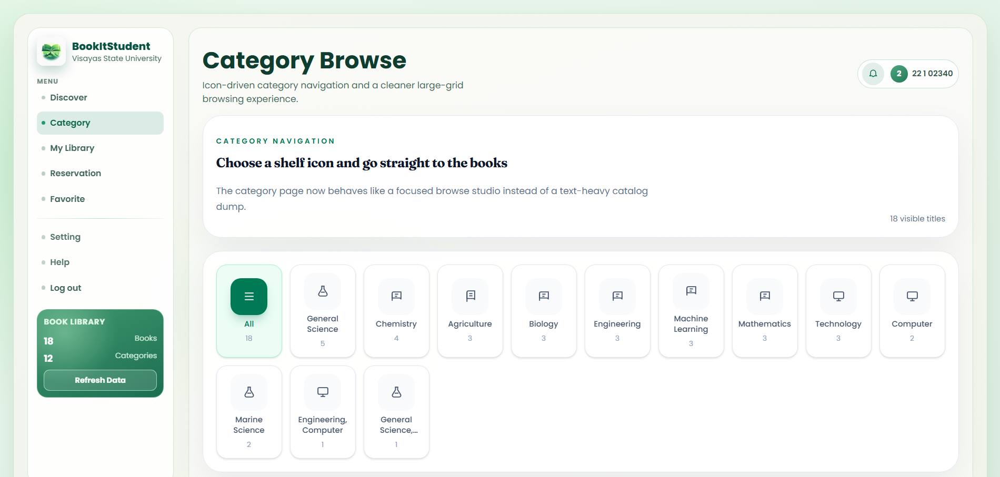

    <table width="100%" cellpadding="10" cellspacing="0" style="font-family: Arial, sans-serif; border-collapse: collapse;">
        <tr>
            <td colspan="2" style="padding-bottom: 20px;">
                <h1 style="margin: 0;">DigitalWare Library System</h1>
                
Target: DW010.001

            </td>
        </tr>
        <tr>
            <td width="25%" valign="top" style="border: 1px solid #e0e0e0; border-right: none;">
                <h2 style="margin-top: 0;">Site Map</h2>
                <a href="README.md">Homepage</a>                   
                
<strong>1. Authentication & Identity</strong>

                <ul style="list-style-type: none; padding-left: 0; font-size: 0.9em;">
                    <li style="padding-left: 15px"> <a href="docs/auth/authentication-sign-up.md"> Login with Google (FR 1.0) </a></li>
                </ul>
                
<strong>2. Student Viewer Hub</strong>

                <ul style="list-style-type: none; padding-left: 0; font-size: 0.9em;">
                    <li style="padding-left: 15px"><a href="docs/student/dashboard.md">Dashboard (FR 1.0)</a></li>
                    <li style="padding-left: 15px"><a href="docs/student/reserve-book.md">Reserve Book (FR 2.0)</a></li>
                    <li style="padding-left: 15px"><a href="docs/student/reservation-notifier.md">Reservation Notifier (FR 2.1)</a></li>
                    <li style="padding-left: 15px"><a href="docs/student/book-search.md">Book Search (FR 3.0)</a></li>
                    <li style="padding-left: 15px"><a href="docs/student/availability.md">Real-Time Availability (FR 4.0)</a></li>
                    <li style="padding-left: 15px"><a href="docs/student/borrowing-history.md">Borrowing History (FR 5.0)</a></li>
                    <li style="padding-left: 15px"><a href="docs/student/book-categories.md">Book Categories (FR 6.0)</a></li>
                </ul>
                
<strong>3. Librarian Management Portal</strong>

                <ul style="list-style-type: none; padding-left: 0; font-size: 0.9em;">
                    <li style="padding-left: 15px"><a href="docs/librarian/dashboard.md">Librarian Dashboard (FR 7.0)</a></li>
                    <li style="padding-left: 15px"><a href="docs/librarian/approve-checkout.md">Approve Checkout (FR 7.0)</a></li>
                    <li style="padding-left: 15px"><a href="docs/librarian/process-return.md">Process Return (FR 7.0)</a></li>
                    <li style="padding-left: 15px"><a href="docs/librarian/book-record-manager.md">Book Record Manager (FR 7.0)</a></li>
                    <li style="padding-left: 15px"><a href="docs/librarian/overdue-notifier.md">Overdue Notifier (FR 8.0)</a></li>
                </ul>
                
<strong>4. Shared</strong>

                <ul style="list-style-type: none; padding-left: 0; font-size: 0.9em;">
                    <li style="padding-left: 15px"><a href="docs/shared/account-settings.md">Account Settings (FR 1.0)</a></li>
                    <li style="padding-left: 15px"><a href="docs/shared/book-detail.md">Book Detail (FR 3.0 / 4.0)</a></li>
                    <li style="padding-left: 15px"><a href="docs/shared/notification-center.md">Notification Center (FR 2.1 / 8.0)</a></li>
                </ul>
            </td>
            <td valign="top" style="border: 1px solid #e0e0e0; padding: 20px;">
                

                    <a href="docs/student/" style="text-decoration: none;">Student Viewer Hub</a> &gt; 
                    <a href="docs/student/book-categories.md" style="color: #ac9e9e; font-weight: bold; text-decoration: none;">Book Categories</a>
                
           
                

                    
                

                <h2 style="margin-top: 0;">Book Categories (FR 6.0)</h2>
                
The Book Categories feature organizes the library's collection into logical groups based on genre, subject, or academic discipline. Students can browse books by category to discover new titles or find books related to their interests or field of study.

                
Common categories include Fiction, Non-Fiction, Science, Technology, Engineering, Mathematics, History, Literature, and Reference. Each category displays the number of available books and popular titles within that category, making it easier for students to explore the library collection.

                <h3>Use Case Scenario</h3>
                <table border="1" width="100%" cellpadding="8" cellspacing="0" style="border-collapse: collapse; font-size: 0.9em; border: 1px solid #ddd;">
                    <tr>
                        <th width="20%" align="left">Actor(s)</th>
                        <td>Student</d>
                    </tr>
                    <tr>
                        <th align="left">Goal</th>
                        <td>To browse the library collection by category to find books of interest.</d>
                    </tr>
                    <tr>
                        <th align="left">Preconditions</th>
                        <td>1. Student is logged into the system. 2. Books in the catalog are organized into categories.</d>
                    </tr>
                    <tr>
                        <th align="left">Main Scenario</th>
                        <td>1. Student navigates to the Book Categories page. 2. System displays a list of available categories with book counts. 3. Student selects a category (e.g., Science, Fiction, History). 4. System displays all books belonging to that category. 5. Student clicks on a book to view details or make a reservation.</d>
                    </tr>
                    <tr>
                        <th align="left">Outcome</th>
                        <td>Student discovers books by category and can explore the library collection more effectively.</d>
                    </tr>
                </table>
            </d>
        </tr>
        <tr>
            <td colspan="2" align="center" style="padding-top: 30px; font-size: 0.8em; color: #999;">
                

                © 2026 BookItStudent | VSU Library System
            </d>
        </tr>
    </table>

