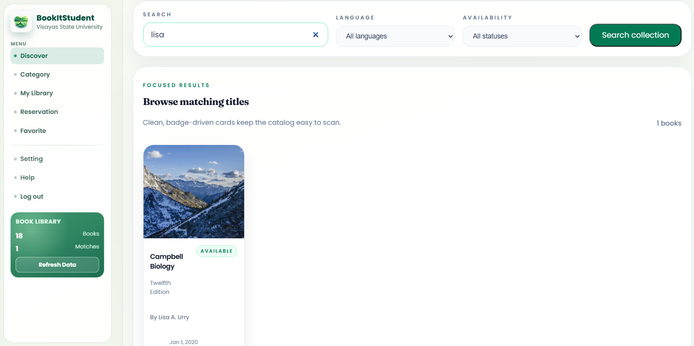

    <table width="100%" cellpadding="10" cellspacing="0" style="font-family: Arial, sans-serif; border-collapse: collapse;">
        <tr>
            <td colspan="2" style="padding-bottom: 20px;">
                <h1 style="margin: 0;">DigitalWare Library System</h1>
                
Target: DW010.001

            </td>
        </tr>
        <tr>
            <td width="25%" valign="top" style="border: 1px solid #e0e0e0; border-right: none;">
                <h2 style="margin-top: 0;">Site Map</h2>
                <a href="README.md">Homepage</a>                   
                
<strong>1. Authentication & Identity</strong>

                <ul style="list-style-type: none; padding-left: 0; font-size: 0.9em;">
                    <li style="padding-left: 15px"> <a href="docs/auth/authentication-sign-up.md"> Login with Google (FR 1.0) </a></li>
                </ul>
                
<strong>2. Student Viewer Hub</strong>

                <ul style="list-style-type: none; padding-left: 0; font-size: 0.9em;">
                    <li style="padding-left: 15px"><a href="docs/student/dashboard.md">Dashboard (FR 1.0)</a></li>
                    <li style="padding-left: 15px"><a href="docs/student/reserve-book.md">Reserve Book (FR 2.0)</a></li>
                    <li style="padding-left: 15px"><a href="docs/student/reservation-notifier.md">Reservation Notifier (FR 2.1)</a></li>
                    <li style="padding-left: 15px"><a href="docs/student/book-search.md">Book Search (FR 3.0)</a></li>
                    <li style="padding-left: 15px"><a href="docs/student/availability.md">Real-Time Availability (FR 4.0)</a></li>
                    <li style="padding-left: 15px"><a href="docs/student/borrowing-history.md">Borrowing History (FR 5.0)</a></li>
                    <li style="padding-left: 15px"><a href="docs/student/book-categories.md">Book Categories (FR 6.0)</a></li>
                </ul>
                
<strong>3. Librarian Management Portal</strong>

                <ul style="list-style-type: none; padding-left: 0; font-size: 0.9em;">
                    <li style="padding-left: 15px"><a href="docs/librarian/dashboard.md">Librarian Dashboard (FR 7.0)</a></li>
                    <li style="padding-left: 15px"><a href="docs/librarian/approve-checkout.md">Approve Checkout (FR 7.0)</a></li>
                    <li style="padding-left: 15px"><a href="docs/librarian/process-return.md">Process Return (FR 7.0)</a></li>
                    <li style="padding-left: 15px"><a href="docs/librarian/book-record-manager.md">Book Record Manager (FR 7.0)</a></li>
                    <li style="padding-left: 15px"><a href="docs/librarian/overdue-notifier.md">Overdue Notifier (FR 8.0)</a></li>
                </ul>
                
<strong>4. Shared</strong>

                <ul style="list-style-type: none; padding-left: 0; font-size: 0.9em;">
                    <li style="padding-left: 15px"><a href="docs/shared/account-settings.md">Account Settings (FR 1.0)</a></li>
                    <li style="padding-left: 15px"><a href="docs/shared/book-detail.md">Book Detail (FR 3.0 / 4.0)</a></li>
                    <li style="padding-left: 15px"><a href="docs/shared/notification-center.md">Notification Center (FR 2.1 / 8.0)</a></li>
                </ul>
            </td>
            <td valign="top" style="border: 1px solid #e0e0e0; padding: 20px;">
                

                    <a href="docs/student/" style="text-decoration: none;">Student Viewer Hub</a> &gt; 
                    <a href="docs/student/book-search.md" style="color: #ac9e9e; font-weight: bold; text-decoration: none;">Book Search</a>
                
           
                

                    
                

                <h2 style="margin-top: 0;">Book Search (FR 3.0)</h2>
                
The Book Search feature allows students to search for books in the VSU library catalog using various criteria such as title, author, ISBN, or keywords. The search functionality provides quick and accurate results, helping students find the books they need efficiently.

                
Students can apply filters to narrow down search results by category, publication year, or availability status. Search results display key information including book title, author, availability, and location within the library.

                <h3>Use Case Scenario</h3>
                <table border="1" width="100%" cellpadding="8" cellspacing="0" style="border-collapse: collapse; font-size: 0.9em; border: 1px solid #ddd;">
                    <tr>
                        <th width="20%" align="left">Actor(s)</th>
                        <td>Student</d>
                    </tr>
                    <tr>
                        <th align="left">Goal</th>
                        <td>To find specific books in the library catalog using search criteria and filters.</d>
                    </tr>
                    <tr>
                        <th align="left">Preconditions</th>
                        <td>1. Student is logged into the system. 2. The library catalog database is populated with book records.</d>
                    </tr>
                    <tr>
                        <th align="left">Main Scenario</th>
                        <td>1. Student navigates to the Book Search page. 2. Student enters search keywords (title, author, ISBN, or general keywords). 3. System displays matching results in real-time or after submission. 4. Student applies filters (category, year, availability) to refine results. 5. Student clicks on a book to view detailed information.</d>
                    </tr>
                    <tr>
                        <th align="left">Outcome</th>
                        <td>Student finds desired book(s) and can view detailed information or proceed to reservation.</d>
                    </tr>
                </table>
            </d>
        </tr>
        <tr>
            <td colspan="2" align="center" style="padding-top: 30px; font-size: 0.8em; color: #999;">
                

                © 2026 BookItStudent | VSU Library System
            </d>
        </tr>
    </table>

