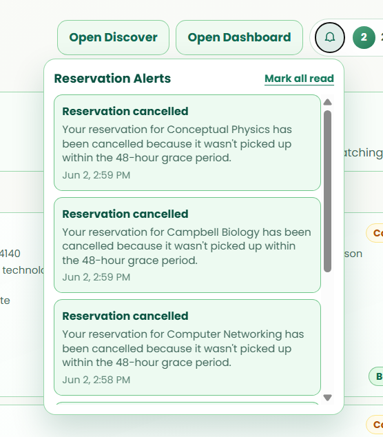

    <table width="100%" cellpadding="10" cellspacing="0" style="font-family: Arial, sans-serif; border-collapse: collapse;">
        <tr>
            <td colspan="2" style="padding-bottom: 20px;">
                <h1 style="margin: 0;">DigitalWare Library System</h1>
                
Target: DW010.001

            </td>
        </tr>
        <tr>
            <td width="25%" valign="top" style="border: 1px solid #e0e0e0; border-right: none;">
                <h2 style="margin-top: 0;">Site Map</h2>
                <a href="README.md">Homepage</a>                   
                
<strong>1. Authentication & Identity</strong>

                <ul style="list-style-type: none; padding-left: 0; font-size: 0.9em;">
                    <li style="padding-left: 15px"> <a href="docs/auth/authentication-sign-up.md"> Login with Google (FR 1.0) </a></li>
                </ul>
                
<strong>2. Student Viewer Hub</strong>

                <ul style="list-style-type: none; padding-left: 0; font-size: 0.9em;">
                    <li style="padding-left: 15px"><a href="docs/student/dashboard.md">Dashboard (FR 1.0)</a></li>
                    <li style="padding-left: 15px"><a href="docs/student/reserve-book.md">Reserve Book (FR 2.0)</a></li>
                    <li style="padding-left: 15px"><a href="docs/student/reservation-notifier.md">Reservation Notifier (FR 2.1)</a></li>
                    <li style="padding-left: 15px"><a href="docs/student/book-search.md">Book Search (FR 3.0)</a></li>
                    <li style="padding-left: 15px"><a href="docs/student/availability.md">Real-Time Availability (FR 4.0)</a></li>
                    <li style="padding-left: 15px"><a href="docs/student/borrowing-history.md">Borrowing History (FR 5.0)</a></li>
                    <li style="padding-left: 15px"><a href="docs/student/book-categories.md">Book Categories (FR 6.0)</a></li>
                </ul>
                
<strong>3. Librarian Management Portal</strong>

                <ul style="list-style-type: none; padding-left: 0; font-size: 0.9em;">
                    <li style="padding-left: 15px"><a href="docs/librarian/dashboard.md">Librarian Dashboard (FR 7.0)</a></li>
                    <li style="padding-left: 15px"><a href="docs/librarian/approve-checkout.md">Approve Checkout (FR 7.0)</a></li>
                    <li style="padding-left: 15px"><a href="docs/librarian/process-return.md">Process Return (FR 7.0)</a></li>
                    <li style="padding-left: 15px"><a href="docs/librarian/book-record-manager.md">Book Record Manager (FR 7.0)</a></li>
                    <li style="padding-left: 15px"><a href="docs/librarian/overdue-notifier.md">Overdue Notifier (FR 8.0)</a></li>
                </ul>
                
<strong>4. Shared</strong>

                <ul style="list-style-type: none; padding-left: 0; font-size: 0.9em;">
                    <li style="padding-left: 15px"><a href="docs/shared/account-settings.md">Account Settings (FR 1.0)</a></li>
                    <li style="padding-left: 15px"><a href="docs/shared/book-detail.md">Book Detail (FR 3.0 / 4.0)</a></li>
                    <li style="padding-left: 15px"><a href="docs/shared/notification-center.md">Notification Center (FR 2.1 / 8.0)</a></li>
                </ul>
            </td>
            <td valign="top" style="border: 1px solid #e0e0e0; padding: 20px;">
                

                    <a href="docs/student/" style="text-decoration: none;">Student Viewer Hub</a> &gt; 
                    <a href="docs/student/reservation-notifier.md" style="color: #ac9e9e; font-weight: bold; text-decoration: none;">Reservation Notifier</a>
                
           
                

                    
                

                <h2 style="margin-top: 0;">Reservation Notifier (FR 2.1)</h2>
                
The Reservation Notifier feature automatically sends real-time notifications to students regarding the status of their book reservations. Students receive alerts when their reservation is confirmed, ready for pickup, or if there are any changes or cancellations. This feature ensures that students stay informed about their library requests without needing to manually check the system.

                
Notifications can be received through multiple channels including in-app notifications, email, or push notifications depending on system configuration and user preferences. The notifier integrates with the dashboard and notification center to provide a centralized view of all reservation-related updates.

                <h3>Use Case Scenario</h3>
                <table border="1" width="100%" cellpadding="8" cellspacing="0" style="border-collapse: collapse; font-size: 0.9em; border: 1px solid #ddd;">
                    <tr>
                        <th width="20%" align="left">Actor(s)</th>
                        <td>Student, System Notification Service</d>
                    </tr>
                    <tr>
                        <th align="left">Goal</th>
                        <td>To receive automatic real-time updates about book reservation status without manual checking.</d>
                    </tr>
                    <tr>
                        <th align="left">Preconditions</th>
                        <td>1. Student is logged in and has an active account. 2. Student has made a book reservation. 3. Notification preferences are configured (if applicable).</d>
                    </tr>
                    <tr>
                        <th align="left">Main Scenario</th>
                        <td>1. Student makes a reservation for a book. 2. System automatically sends a confirmation notification to the student. 3. Librarian updates the reservation status (e.g., ready for pickup, approved, cancelled). 4. System triggers a real-time notification to the student. 5. Student receives the notification on their dashboard and selected channels. 6. Student clicks the notification to view reservation details.</d>
                    </tr>
                    <tr>
                        <th align="left">Alternative Flow</th>
                        <td>If a reservation is cancelled or delayed, the system sends an immediate notification explaining the reason and suggesting alternative actions.</d>
                    </tr>
                    <tr>
                        <th align="left">Outcome</th>
                        <td>Student receives timely updates about their reservation status and can take appropriate action (e.g., picking up a ready book or adjusting a cancelled reservation).</d>
                    </tr>
                </table>
            </d>
        </tr>
        <tr>
            <td colspan="2" align="center" style="padding-top: 30px; font-size: 0.8em; color: #999;">
                

                © 2026 BookItStudent | VSU Library System
            </d>
        </tr>
    </table>

